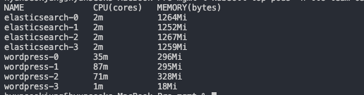

# 부하 테스트

HPA가 정확히 동작하는 지 확인 하기 위해 부하테스트를 진행 해봅니다.

우선 현재 사용률을 체크해봅니다. 

```text
kubectl top pods -n ttc-team-03
```



```text
kubectl get hpa -n ttc-team-03
```


부하를 위한 스크립트를 다음과 같이 구성

```text
# Script generated by Blazemeter Chrome Extension

execution:
  - scenario: ttc-team-03
    concurrency: 20
    ramp-up: 1m
    hold-for: 19m
scenarios:
  ttc-team-03:
    headers:
      User-Agent: 'Mozilla/5.0 (Macintosh; Intel Mac OS X 10_15_6) AppleWebKit/537.36 (KHTML, like Gecko) Chrome/85.0.4183.83 Safari/537.36'
    requests:
      - transaction: Test
        force-parent-sample: false
        do:
          - url: 'http://team03.sk-ttc.com/index.php/product-category/action-reflex-games/'
            method: GET
            label: 'http://team03.sk-ttc.com/index.php/product-category/action-reflex-games/'
            think-time: 0ms
            headers:
              Upgrade-Insecure-Requests: '1'
              Accept: 'text/html,application/xhtml+xml,application/xml;q=0.9,image/avif,image/webp,image/apng,*/*;q=0.8,application/signed-exchange;v=b3;q=0.9'
          - url: 'http://team03.sk-ttc.com/index.php/wp-json/jetpack/v4/scan'
            method: GET
            label: 'http://team03.sk-ttc.com/index.php/wp-json/jetpack/v4/scan'
            headers:
              X-WP-Nonce: 4a9bab0eeb
              Accept: '*/*'
          - url: 'http://team03.sk-ttc.com/?wc-ajax=add_to_cart'
            method: POST
            label: 'http://team03.sk-ttc.com/?wc-ajax=add_to_cart'
            headers:
              Accept: 'application/json, text/javascript, */*; q=0.01'
              X-Requested-With: XMLHttpRequest
              Content-Type: application/x-www-form-urlencoded; charset=UTF-8
            body:
              product_id: '160'
              product_sku: ''
              quantity: '1'
          - url: 'http://team03.sk-ttc.com/index.php/cart/'
            method: GET
            label: 'http://team03.sk-ttc.com/index.php/cart/'
            think-time: 1641ms
            headers:
              Upgrade-Insecure-Requests: '1'
              Accept: 'text/html,application/xhtml+xml,application/xml;q=0.9,image/avif,image/webp,image/apng,*/*;q=0.8,application/signed-exchange;v=b3;q=0.9'
          - url: 'http://team03.sk-ttc.com/index.php/wp-json/jetpack/v4/scan'
            method: GET
            label: 'http://team03.sk-ttc.com/index.php/wp-json/jetpack/v4/scan'
            headers:
              X-WP-Nonce: 4a9bab0eeb
              Accept: '*/*'
          - url: 'http://team03.sk-ttc.com/index.php/checkout/'
            method: GET
            label: 'http://team03.sk-ttc.com/index.php/checkout/'
            think-time: 3343ms
            headers:
              Upgrade-Insecure-Requests: '1'
              Accept: 'text/html,application/xhtml+xml,application/xml;q=0.9,image/avif,image/webp,image/apng,*/*;q=0.8,application/signed-exchange;v=b3;q=0.9'
          - url: 'http://team03.sk-ttc.com/index.php/wp-json/jetpack/v4/scan'
            method: GET
            label: 'http://team03.sk-ttc.com/index.php/wp-json/jetpack/v4/scan'
            headers:
              X-WP-Nonce: 4a9bab0eeb
              Accept: '*/*'
          - url: 'http://team03.sk-ttc.com/?wc-ajax=update_order_review'
            method: POST
            label: 'http://team03.sk-ttc.com/?wc-ajax=update_order_review'
            headers:
              Accept: '*/*'
              X-Requested-With: XMLHttpRequest
              Content-Type: application/x-www-form-urlencoded; charset=UTF-8
            body:
              address: ''
              address_2: ''
              city: ''
              country: KR
              has_full_address: 'false'
              payment_method: ppec_paypal
              post_data: 'billing_first_name=&billing_last_name=&billing_company=&billing_country=KR&billing_address_1=&billing_address_2=&billing_city=&billing_state=&billing_postcode=&billing_phone=&billing_email=ttc%40sk-ttc.com&shipping_first_name=&shipping_last_name=&shipping_company=&shipping_country=KR&shipping_address_1=&shipping_address_2=&shipping_city=&shipping_state=&shipping_postcode=&shipping_phone=&order_comments=&shipping_method%5B0%5D=free_shipping%3A1&payment_method=ppec_paypal&woocommerce-process-checkout-nonce=3a138c02aa&_wp_http_referer=%2Findex.php%2Fcheckout%2F'
              postcode: ''
              s_address: ''
              s_address_2: ''
              s_city: ''
              s_country: KR
              s_postcode: ''
              s_state: ''
              security: 9eaf53d98b
              'shipping_method[0]': 'free_shipping:1'
              state: ''

```

편하게 blazemeter로 부하 테스틑 진행해봅니다.

현재 백엔드 부하는 다음과 같이 보여집니다.


20 명 동시 접속하여 상품을 장바구니에 담고 결제하기 전 까지 부하테스트 진행


